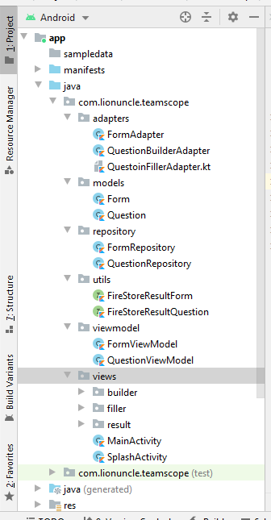
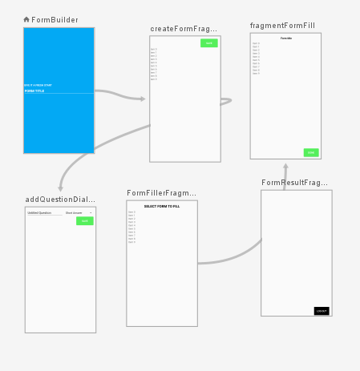

	<h1> 🦉 Teamscope-sample-app 
	</h1>

> A form creating, filling and management application built with latest dependencies and best code practices

## 🏗 STRUCTURE

The project follows MVVM design pattern.

### -Repository
The repository is responsible for fetching and storing data. Since this project uses Firebase as a backend, it gets and sets data to it and has been implemented with singleton design pattern. So, there will be only 1 instance created

### -ViewModel
The viewmodels are lifecycle aware data manipulation classes. They provide data to the view.

### -Views
The views hold activities and fragments. There is no business logic in views. Their single responsibility is to show data fetched from view models

## 👨🏻‍💻 AUTHOR

Howdy, you! This is [Muhammad Aqib](http://aqib.engineer/), an aspiring Android Developer. Connect with me:

 

## 🔑 LICENSE

- MIT
